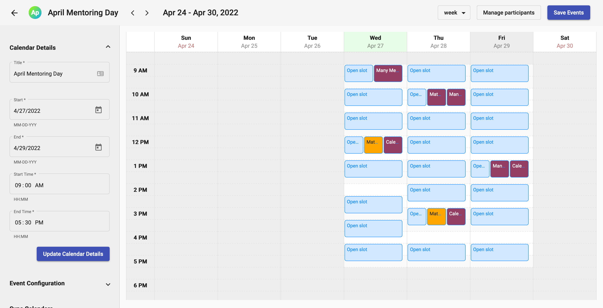

# ManyMeet

A scheduling tool for event organizers that need to manage and facilitate meetings for groups of people.

## Demo
Check out the [video](https://www.youtube.com/watch?v=FFEztDTd5Ls) for a brief overview of the app.

## Backend
   

## Frontend
  

## Integrations

  

  
  
#
## Getting Started
1. From the root folder `npm i` to install client and server dependencies.
1. Add a `server/.env` file with the credentials. See `server/.env.example` for reference.
1. This app integrates with google calendar, so some of the functionality requires a google developer account.
1. From the root folder start the server with `npm run start:server`
1. Ensure that the db was created properly. 
1. From the root folder in a new terminal window start the client with `npm run start:client` 
1. Access the app at `http://localhost:4200`
1. Endpoints with sample data can be found in the `ManyMeet.postman_collection.json` in the root folder.

## Contributing
Contributions are welcome. Fork this repo and send a pull request for review. There are some [open issues and features](https://github.com/ManyMeet/ManyMeet/issues) documented in the Github issues tab. 
